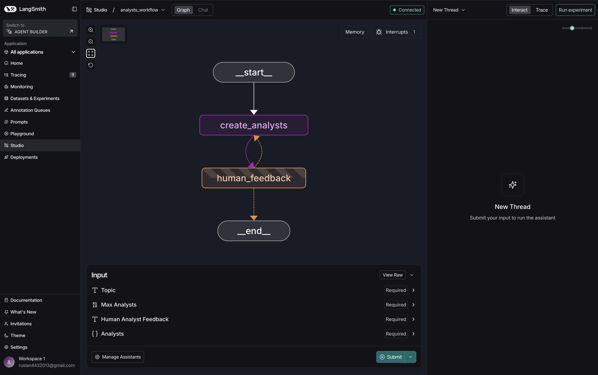
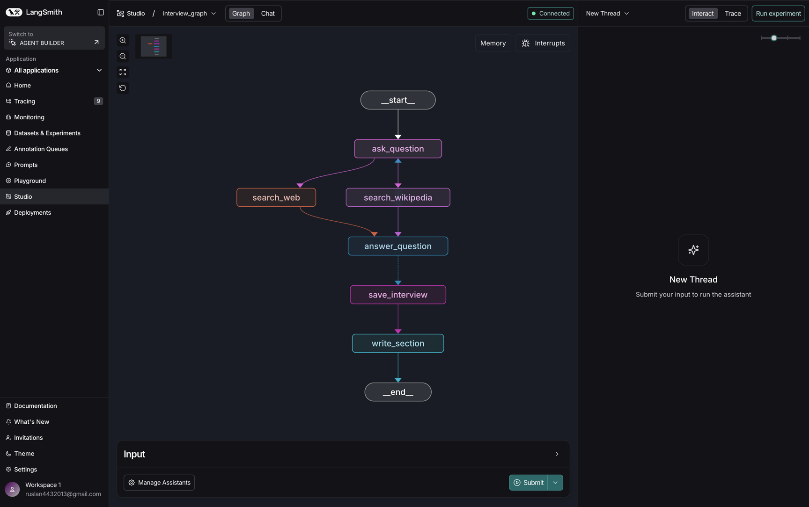

# Обучающий пример LangGraph

Этот репозиторий является учебным пособием по созданию сложных многоагентных систем с
использованием [LangGraph](https://langchain-ai.github.io/langgraph/). Здесь демонстрируются ключевые концепции
фреймворка: управление состоянием (State), циклические графы, использование инструментов поиска и взаимодействие с
человеком (Human-in-the-loop).

## Основные возможности

- **Итеративная генерация персон**: Создание специализированных ролей аналитиков с возможностью ручной корректировки.
- **Интеллектуальный поиск**: Интеграция с Tavily и Wikipedia для сбора актуальных данных.
- **Автоматизация интервью**: Процесс сбора знаний через диалог между агентами.
- **Генерация отчетов**: Синтез собранной информации в структурированные разделы.

## Структура проекта

- `src/assistant_intro/`: Вводные примеры работы с LangGraph.
    - `analysts_workflow.py`: Граф для генерации персон аналитиков с возможностью прерывания для получения обратной
      связи от человека (Human-in-the-loop).
    - `answer_generation.py`: Сложный граф для проведения интервью, поиска информации в Wikipedia и Tavily, и
      последующей генерации отчета.
    - `llm.py`: Инициализация модели ChatOpenAI.
    - `expert.py`: Определения состояний и узлов для экспертной системы.
- `langgraph.json`: Конфигурация для LangGraph Cloud или локальной студии.
- `.env.example`: Пример файла с переменными окружения.

## Установка

1. Клонируйте репозиторий.
2. Установите зависимости:
   ```bash
   pip install -r requirements.txt
   ```
3. Создайте файл `.env` на основе `.env.example` и заполните необходимые API ключи (OpenAI, Tavily, LangSmith).

## Запуск графов

### Генерация аналитиков (`analysts_workflow`)

Этот пример демонстрирует использование `interrupt_before` для получения обратной связи от человека.



**Как это работает:**

1. **START**: Принимает тему исследования.
2. **create_analysts**: LLM генерирует список персон (аналитиков) с их ролями и описанием.
3. **human_feedback**: Граф прерывается. На этом этапе пользователь может посмотреть список аналитиков и оставить
   комментарий (например, "добавь эксперта по стартапам").
4. **should_continue**: Если есть отзыв от человека, граф возвращается в `create_analysts` для обновления списка, если
   нет — завершается.

```bash
python src/assistant_intro/analysts_workflow.py
```

### Генерация ответов через интервью (`interview_graph`)

Этот пример демонстрирует сложную логику переходов, работу с инструментами поиска и сохранение состояния.



**Как это работает:**

1. **ask_question**: Аналитик формулирует вопрос к эксперту.
2. **search_web** & **search_wikipedia**: Параллельный запуск поиска информации в Tavily и Wikipedia для обогащения
   контекста ответа.
3. **answer_question**: Генерация ответа эксперта на основе найденной информации.
4. **route_messages**: Условный переход. Если цикл интервью не закончен (по количеству ходов), возвращается к
   `ask_question`.
5. **save_interview**: Сохранение полного транскрипта диалога.
6. **write_section**: Финальное написание раздела отчета на основе собранных в ходе интервью данных.

```bash
python src/assistant_intro/answer_generation.py
```

## Использование с LangGraph Studio

Проект настроен для работы с LangGraph Studio. В файле `langgraph.json` определены следующие графы:

- `analysts_workflow`: Генерация аналитиков.
- `interview_graph`: Проведение интервью и написание разделов отчета.
