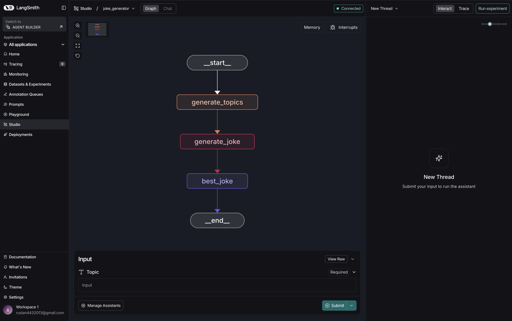

# Чат-бот с саммаризацией сообщений и памятью на SQLite (LangGraph)

Учебный пример реализации интеллектуального чат-бота с использованием библиотеки LangGraph. Бот обладает способностью
запоминать контекст беседы, используя базу данных SQLite, и автоматически суммировать историю сообщений для экономии
токенов и поддержания длинных диалогов.

## Основные возможности

- **Долгосрочная память**: Использование `SqliteSaver` для сохранения состояния диалога между запусками (чекпоинтинг).
- **Автоматическая саммаризация**: При превышении лимита сообщений (в данном примере > 6), бот генерирует краткое
  содержание предыдущей беседы и удаляет старые сообщения, оставляя только `summary` и последние сообщения.
- **Управление состоянием**: Использование расширенного `MessagesState` для хранения сводки (`summary`).

## Визуализация графа

Ниже представлена структура рабочего процесса (workflow) бота:



## Логика работы

1. **conversation**: Основной узел вызова LLM. Если в состоянии уже есть `summary`, оно подмешивается в контекст как
   системное сообщение.
2. **should_continue**: Условный переход, который проверяет количество сообщений в истории. Если их больше 6, направляет
   поток на саммаризацию.
3. **summarize_conversation**: Узел, отвечающий за создание краткой сводки и очистку истории (через `RemoveMessage`).

## Установка

1. Клонируйте репозиторий.
2. Рекомендуется использовать виртуальное окружение:
   ```bash
   python -m venv .venv
   source .venv/bin/activate  # для Linux/macOS
   ```
3. Установите зависимости:
   ```bash
   pip install -r requirements.txt
   ```
4. Настройте переменные окружения. Создайте файл `.env` в корне проекта:
   ```env
   OPENAI_API_KEY=ваш_ключ_openai
   ```

## Запуск

Для запуска примера выполните:

```bash
python -m src.main
```

База данных для хранения состояния будет создана автоматически в `src/state_db/example.db`.

---
Проект подготовлен в качестве учебного примера по работе с LangGraph.
