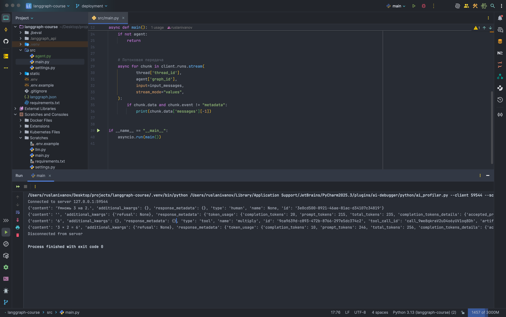

# Учебный пример: React-агент в LangGraph (Deployment Mode)

Данный проект демонстрирует реализацию и деплой агента на базе архитектуры **React** (Reasoning and Acting) с
использованием библиотеки **LangGraph**. В примере показано, как запустить агент в режиме разработки (deployment mode) и
взаимодействовать с ним через клиентское приложение.

## Архитектура

Агент построен на базе `StateGraph` и реализует цикл:

1. **Assistant**: Модель анализирует сообщение и решает, нужно ли вызвать инструмент.
2. **Tools Condition**: Условный переход, проверяющий наличие вызовов инструментов.
3. **Tools**: Выполнение арифметических инструментов (сложение, умножение, деление).
4. **Loop**: Возврат к ассистенту для формирования итогового ответа.

### Схема графа


## Структура проекта

- `src/agent.py` — описание логики графа, инструментов и инициализация LLM.
- `src/main.py` — клиентское приложение, использующее `langgraph-sdk` для отправки запросов к запущенному агенту.
- `src/settings.py` — конфигурация настроек через Pydantic.
- `langgraph.json` — конфигурационный файл для LangGraph Cloud/Dev.
- `static/` — директория с изображениями для документации.

## Настройка

1. Установите зависимости:
   ```bash
   pip install -r requirements.txt
   ```
2. Создайте файл `.env` в корне проекта и добавьте ваши ключи (см. `src/settings.py`):
   ```env
   OPENAI_API_KEY=your_api_key
   LANGSMITH_API_KEY=your_key
   LANGSMITH_TRACING=true
   LANGSMITH_ENDPOINT="https://api.smith.langchain.com"
   LANGSMITH_PROJECT="your_project_name"
   ```

## Запуск

### 1. Запуск LangGraph Server

Для того чтобы код в `src/main.py` смог подключиться к агенту, **обязательно** необходимо запустить сервер в режиме
разработки:

```bash
langgraph dev
```

После запуска сервер будет доступен по адресу `http://127.0.0.1:2024`.

### 2. Запуск клиентского приложения

В другом терминале запустите основной скрипт:

```bash
python src/main.py
```

## Пример работы

Ниже представлен пример вывода в консоли при успешном взаимодействии с агентом через `langgraph dev`:



## Особенности реализации

- Использование `langgraph-sdk` для асинхронного взаимодействия.
- Поддержка потоковой передачи данных (`stream`).
- Автоматический поиск ассистента по `graph_id`.
