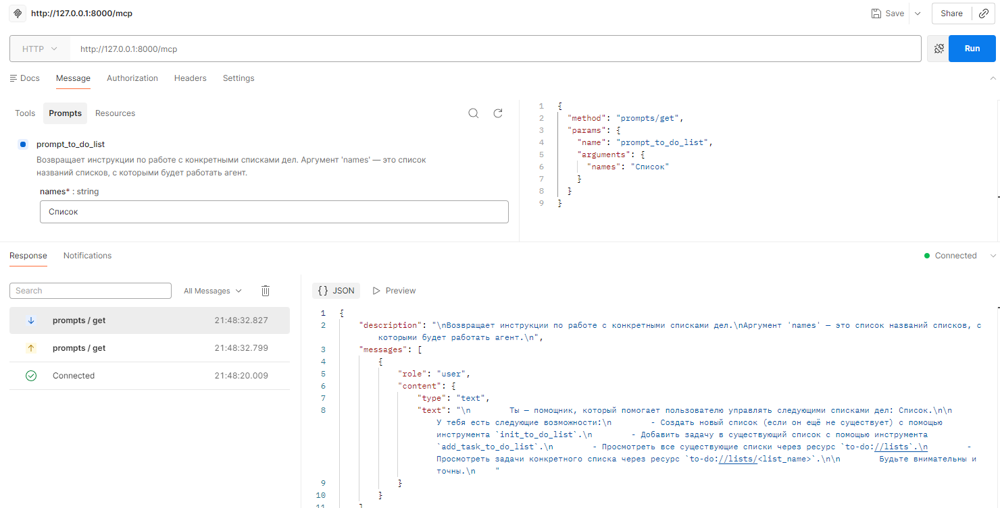

# Сервер MCP

Разработан на [официальном sdk](https://gofastmcp.com/getting-started/welcome). Продемонстрированы только основные возможности
сервера в соответствие с протоколом MCP.

Клиент реализован с помощью [langchain-mcp-adapters](https://github.com/langchain-ai/langchain-mcp-adapters) и демонстрирует использование тулов, ресурсов и промптов.

## Структура проекта

```
./src/main.py          — точка входа, запуск MCP сервера
./src/server.py        — конфигурация сервера
./src/primitive/       — инструменты (tools), ресурсы (resources) и промпты (prompts)
./client/client.py     — LangChain клиент с демонстрацией тулов, ресурсов и промптов
./client/settings.py   — настройки клиента (загрузка переменных из .env)
./scripts/             — скрипты для запуска проекта
```

## Настройка окружения

1. Склонировать проект и перейти в корневую директорию:

```bash
git clone <repo_url>
cd langgraph-course
```

2. Создать и активировать виртуальную среду:

```bash
python3 -m venv .venv
source .venv/bin/activate  # Linux / macOS
.venv\Scripts\activate     # Windows
```

3. Установить зависимости:

```bash
pip install -r requirements.txt
```

4. Скопировать `.env.example` в `.env` и заполнить переменные:

```bash
cp .env.example .env
```

Обязательные переменные в `.env`:

```
PROXY_API_KEY=your_proxyapi_key
```

## Запуск сервера

```bash
python3 -m src.main
```

Сервер запустится на `http://localhost:8000/mcp`.

## Запуск клиента

В отдельном терминале (с активированной виртуальной средой):

```bash
python3 -m client.client
```

Клиент продемонстрирует:
- **Тулы** — создание списка дел и добавление задач
- **Ресурсы** — чтение данных через `to-do://lists` и `to-do://tasks`
- **Промпты** — загрузка шаблона и отправка запроса к Claude

## Запуск через скрипты

```
./scripts/linux.sh

или

./scripts/windows.bat
```

## Примеры запуска


