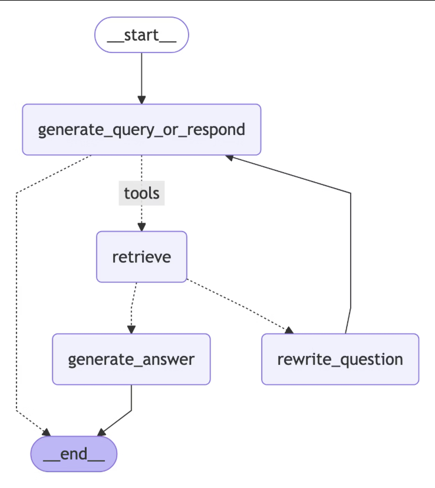
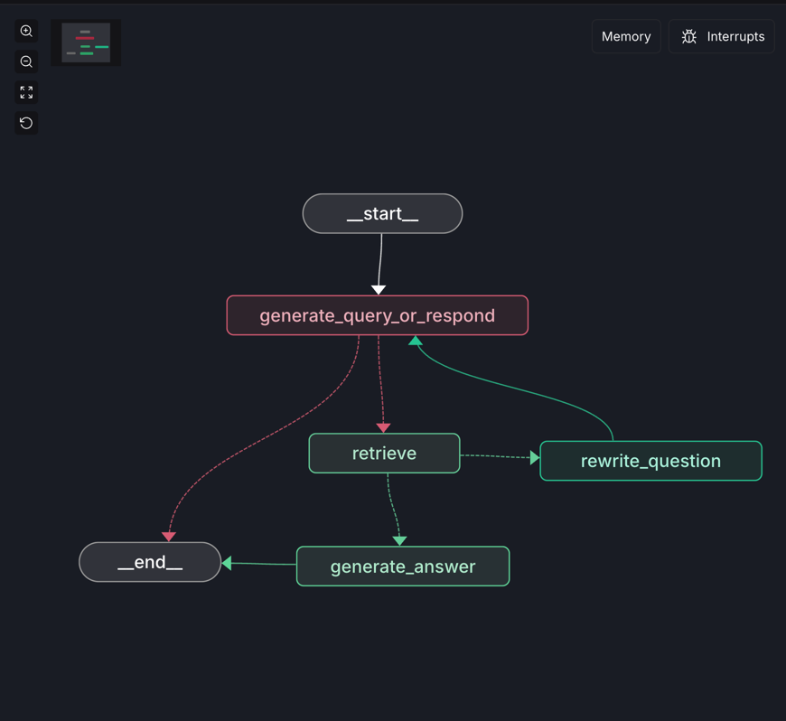

# Custom RAG Agent with LangGraph

Проект по созданию адаптивного RAG (Retrieval-Augmented Generation) агента с использованием LangGraph. Агент способен
самостоятельно решать, нужно ли искать информацию во внешней базе знаний или отвечать на запрос напрямую, а также
оценивать релевантность найденных документов и перефразировать вопросы при необходимости.

## Функциональность

- **Адаптивный поиск**: Использование LLM для принятия решения о вызове инструментов поиска.
- **Оценка релевантности**: Автоматическая проверка найденных документов на соответствие вопросу.
- **Перефразирование вопросов**: Если документы не релевантны, агент переформулирует запрос для улучшения результатов
  поиска.
- **Гибкая настройка**: Использование Pydantic Settings для управления конфигурацией.

## Структура проекта

- `src/graph.py` — Определение графа состояний (workflow) и логики переходов.
- `src/settings.py` — Конфигурация приложения через переменные окружения.
- `src/components/` — Узлы и инструменты графа:
    - `process_documents.py` — Загрузка и разбиение документов.
    - `retriever_tool.py` — Инструмент для семантического поиска в векторном хранилище.
    - `generate_query.py` — Узел принятия решения о поиске или прямом ответе.
    - `grade_documents.py` — Узел оценки релевантности контекста.
    - `rewrite_question.py` — Узел для перефразирования вопроса.
    - `generate_answer.py` — Узел генерации финального ответа.

## Настройка

1. **Установка зависимостей**:
   ```bash
   pip install -r requirements.txt
   ```
   *Основные пакеты: `langgraph`, `langchain`, `openai`, `pydantic-settings`, `bs4`, `tiktoken`.*

2. **Переменные окружения**:
   Создайте файл `.env` в корне проекта по образцу:
   ```env
   LANGSMITH_TRACING=true
   LANGSMITH_ENDPOINT="https://api.smith.langchain.com"
   LANGSMITH_API_KEY="your-api-key"
   LANGSMITH_PROJECT="your-project"
   OPENAI_API_KEY="your-openai-key"
   ```

## Запуск

Основной точкой входа является файл `src/graph.py`. Вы можете запустить его напрямую для демонстрации работы агента:

```bash
python src/graph.py
```

### Пример использования (код)

```python
from src.graph import graph

inputs = {"messages": [{"role": "user", "content": "Что Лилиан Венг говорит о типах взлома вознаграждения?"}]}
for chunk in graph.stream(inputs):
    for node, update in chunk.items():
        print(f"Update from node: {node}")
        update["messages"][-1].pretty_print()
```

## Схема графа



Агент реализует следующий цикл:



1. **Начало** -> Генерация запроса/Ответ.
2. Если нужны инструменты -> **Поиск документов**.
3. После поиска -> **Оценка документов**.
4. Если релевантно -> **Генерация ответа** -> Конец.
5. Если не релевантно -> **Перефразирование вопроса** -> Возврат к шагу 1.
